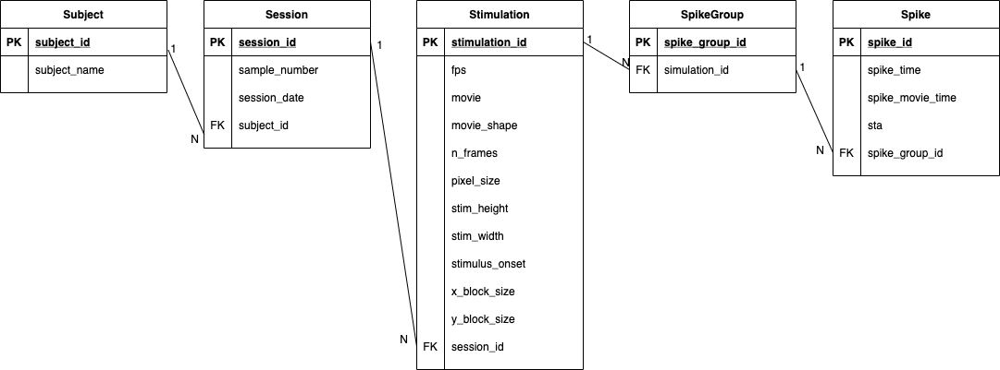
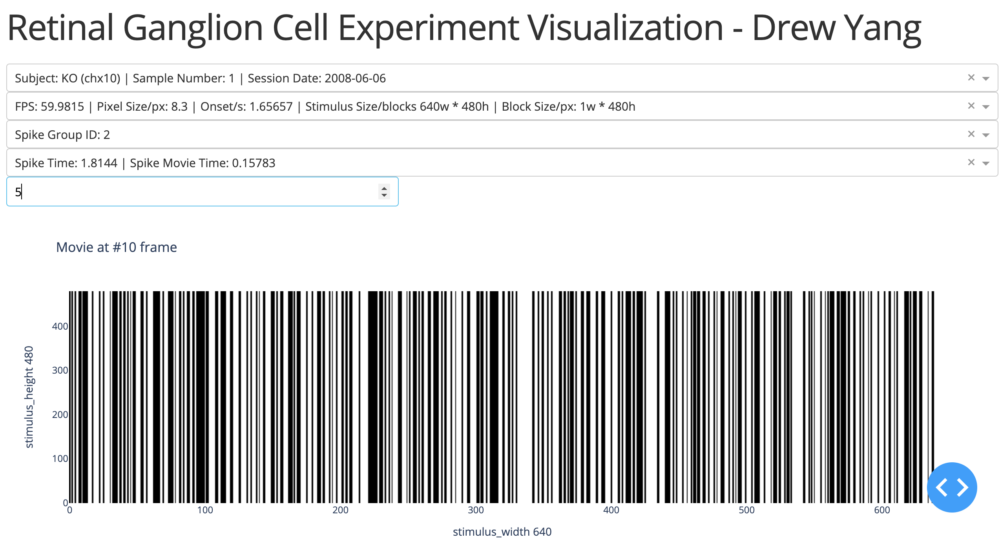

# Datajoint Retinal Ganglion Pipeline

#### -- *Drew Yang*
---

## Table of Content
- [Preparation](#preparation)
- [Pipeline](#pipeline)
    - [Data Source Manifest](#data-source-manifest)
    - [Data Model](#data-model)
        - [ERD](#erd)
        - [Model Definition](#model-definition)
        - [Found Error on macOS](#found-error-on-macos)
    - [Data Loader](#data-loader)
        - [Legacy Loader](#legacy-loader)
        - [Data Loading Module](#data-loading-module)
    - [Commands to work with the pipeline](#commands-to-work-with-the-pipeline)
- [STRF Calculation](#strf-calculation)
- [Visualization](#visualization)
    - [Plotly Dash Server](#plotly-dash-server)
    - [Plotting Module](#plotting-module)
- [Exploration](#exploration)

---

## Preparation

```
pip install -r requirements.txt
```

[Back To Top](#datajoint-retinal-ganglion-pipeline)

---

## Pipeline

#### Data Source Manifest
Data source manifest is designed to register multiple datasources with multiple data types: **structured** like database or csv...; **semi-structured** like json or xml...; **non-structured** like text or logs or even an HTTP request...

> Note: Currently, it only supports pickle files.

```
# ~/data_source_manifest.json 
[{
    "type": "category/type", 
    "access": "the access of the data source"
    "access2":""
    ...
}]
```
- "type": a pre-defined type of one datasource
    - file/pickle
    - file/csv
    - file/json
    - database/mysql
    - database/mssql
    - database/mongodb
    - text/plain
    - text/json
    - http/json
- "access": a specific access of the datasource
    - path
    - connection string
    - credentials
- "access2": some other extra add-on info

[Back To Top](#datajoint-retinal-ganglion-pipeline)

#### Data Model

##### ERD


##### Model Definition
`~/pipeline/ingest/experiment.py`

- Subject
    - *PK* subject_id
    - subject_name
- Session
    - *PK* session_id
    - sample_number
    - session_date
    - *FK* subject_id
- Stimulation
    - *PK* stimulation_id
    - fps
    - movie: movie time = fps * n_frames
    - *movie_shape: derived from movie.shape, for restoring the movie array*
    - n_frames
    - pixel_size
    - stim_height
    - stim_width
    - stimulus_onset
    - x_block_size
    - y_block_size
    - *FK* session_id
- SpikeGroup
    - *PK* spike_group_id
    - *FK* stimulation_id
- Spike
    - *PK* spike_id
    - spike_time
    - *spike_movie_time: derived from (spike_time - stimulus_onset) means spike detected respective to the movie playing time, **correct?***
    - *sta: Spike-Triggered Average of a number of movie frames before the current spike*
    - *FK* spike_group_id

> Note: Data Loading part can still be optimized by Model Definition that using dj.Imported/dj.Computed https://tutorials.datajoint.io/beginner/building-first-pipeline/python/importing-data.html

##### Found Error on macOS
Error: dj.ERD for macOS 11.1 dependency error
```
Traceback (most recent call last):
  File "./pipeline/run.py", line 137, in <module>
    main(args)
  File "./pipeline/run.py", line 118, in main
    plot_erd(tpath)
  File "./pipeline/run.py", line 34, in plot_erd
    dj.ERD(schema).save(os.path.join(tpath, 'ERD.svg'), format='svg')
  File "/Users/yam/opt/anaconda3/envs/datajoint/lib/python3.6/site-packages/datajoint/diagram.py", line 347, in save
    f.write(self.make_svg().data)
  File "/Users/yam/opt/anaconda3/envs/datajoint/lib/python3.6/site-packages/datajoint/diagram.py", line 314, in make_svg
    return SVG(self.make_dot().create_svg())
  File "/Users/yam/opt/anaconda3/envs/datajoint/lib/python3.6/site-packages/pydot.py", line 1734, in new_method
    format=f, prog=prog, encoding=encoding)
  File "/Users/yam/opt/anaconda3/envs/datajoint/lib/python3.6/site-packages/pydot.py", line 1933, in create
    raise OSError(*args)
FileNotFoundError: [Errno 2] "dot" not found in path.
```

[Back To Top](#datajoint-retinal-ganglion-pipeline)

#### Data Loader

##### Legacy Loader
`~/legacy/loader.py`
Initially, I wanted to make a general universal loader that can load multiple data types/data sources without specifying the implementation depending on how data looks like(content formats). However, this is only possible when the coming data follows a common industrial or academic format. So that there is no big difference than making it functional.

##### Data Loading Module
`~/pipeline/load_utils.py`

- `load_<category>_<type>(datasource:dict)`
    - `load_file_pickle(datasource:dict)`
    - `load_file_csv(datasource:dict)`
    - `load_file_json(datasource:dict)`
    - `load_database_mysql(datasource:dict)`
    - `load_database_mysql(datasource:dict)`
    - `load_text_plain(datasource:dict)`
    - `load_text_json(datasource:dict)`
    - `load_http_json(datasource:dict)`

> Note: Currently, it only supports pickle files.

> Note: `datasource:dict` is parsed from data_source_manifest.json. For more detail, check [here](#data-source-manifest).

> Note: Maybe add a feature to load streaming data.

[Back To Top](#datajoint-retinal-ganglion-pipeline)

#### Commands to work with the pipeline
```
# schema is set dynamically as 'USER_retinal'

# credential config(optional)
python ./pipeline/run.py -c CONFIG_INI_PATH
# build tables
python ./pipeline/run.py -db tutorial-db.datajoint.io -u USERNAME -p PASSWORD -b
# clean up tables
python ./pipeline/run.py -db tutorial-db.datajoint.io -u USERNAME -p PASSWORD -b -cln
# load data
python ./pipeline/run.py -db tutorial-db.datajoint.io -u USERNAME -p PASSWORD -b -l ./pipeline/data_source_manifest.json
# load data with log
python ./pipeline/run.py -db tutorial-db.datajoint.io -u USERNAME -p PASSWORD -b -l ./pipeline/data_source_manifest.json > loading.log
# test
python ./pipeline/run.py -db tutorial-db.datajoint.io -u USERNAME -p PASSWORD -t
# save dj.ERD as svg - Error
python ./pipeline/run.py -db tutorial-db.datajoint.io -u USERNAME -p PASSWORD -er CWD
```

[Back To Top](#datajoint-retinal-ganglion-pipeline)

---

### STRF Calculation

#### Understanding
Based on the task description and the wiki's explanation of [STA](https://en.wikipedia.org/wiki/Spike-triggered_average) plus few articles discussing about receptive field in deep learning, from my understanding, STRF is an averaged movie frame calculated by several movie frames that shown previously before each spike detected.

For example, a spike detected at 3.5 seconds, and at that moment, the stimulus movie is playing frame N. So, if the STRF delay is 5 frames, then the STRF = avg(frame N-4 ~ N). The final result should be a 'blur' frame that has the same pixel height/width as the stimulus movie.

#### Computation Module
`~/pipeline/compute_utils.py`
- `get_frame_idx(spike_movie_time:float, fps:float)->int`: from spike detected time -> spike-movie relative time -> spike frame index 
- `get_frame_2darray(stimulation:dict, movie:np.ndarray, n_frames:int)->np.ndarray`: get spike frame from spike frame index
- `get_sta(stimulation:dict, movie:np.ndarray, spike_movie_time:float, n_delays:int=STA_DELAY)->np.ndarray`: get an average of a number/n_delays of previous frames before the spike frame

[Back To Top](#datajoint-retinal-ganglion-pipeline)

---

## Visualization

#### Plotly Dash Server
```
# Required: setup credential config file ~/visualization/config.ini
python ./visualization/app.py
# then access http://localhost:8050
# other people under the same network can access http://<YOUR_IP>:8050
```



#### Plotting Module
`./visualization/plot_utils.py`
- `plot_frame(n_frames:int, frame:np.ndarray)->go.Figure()`: plot the current selected spike's frame
- `plot_sta(n_frames:int, n_frames_of_delay:int, sta:np.ndarray)->go.Figure()`: plot the STA that averaged by the selected spike's frame and the number of previous frames

[Back To Top](#datajoint-retinal-ganglion-pipeline)

---

## Exploration
```
# STRF, visualization
~/notebooks/visualization_explore.ipynb
# data set
~/notebooks/data_discovery.ipynb
# database config
~/notebooks/db_conn_test.ipynb
```

[Back To Top](#datajoint-retinal-ganglion-pipeline)

---

- setup.py is not ready
- documentation needs updates
- logger is not ready
- DataModel-Loader can still be optimized
- STRF calculation/storage has uncertainty

[Back To Top](#datajoint-retinal-ganglion-pipeline)

---